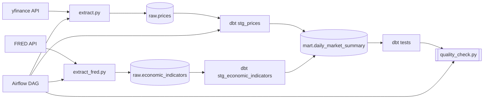
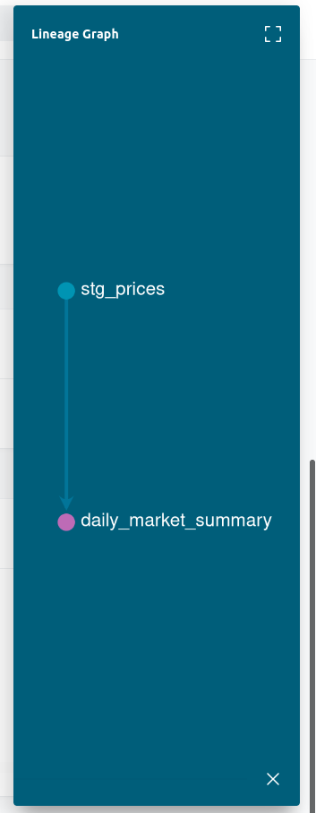

# Market Data Pipeline

A production-style ELT pipeline that ingests daily market data from multiple sources, 
computes technical indicators, enriches with macroeconomic context, and produces an 
analysis-ready mart table suitable for ML or BI consumption.

## Architecture

## Stack
 - Apache Airflow - orchestration
 - PostgreSQL - data warehouse
 - dbt - transformation layer
 - Python - extract and load scripts
 - Docker - containerized deployment

## Layers
 - `raw.prices` - raw data from yfinance (stocks + crypto)
 - `raw.economic_indicators` - macro data from FRED (interest rates, CPI, oil)
 - `staging.stg_prices` - prices enriched with MA7, MA21, RSI14, volatility
 - `staging.stg_economic_indicators` - cleaned economic indicator series
 - `mart.daily_market_summary` - joined mart with prices + macro context per day

## How to run
1. `git clone` the project
2. Copy the `.env.example` to `.env` and fill in the variables
3. Run `docker compose up -d --build`
4. Airflow UI: `http://localhost:8080` (admin/admin)
5. PgAdmin `http://localhost:5050`
6. Trigger the `market_data_pipeline` DAG manually

## Airflow DAG
extract_load_raw  -
                   |-> transform_load_mart -> quality_check
extract_load_fred -

## Data Catalog

dbt auto-generates documentation for all models and their lineage

